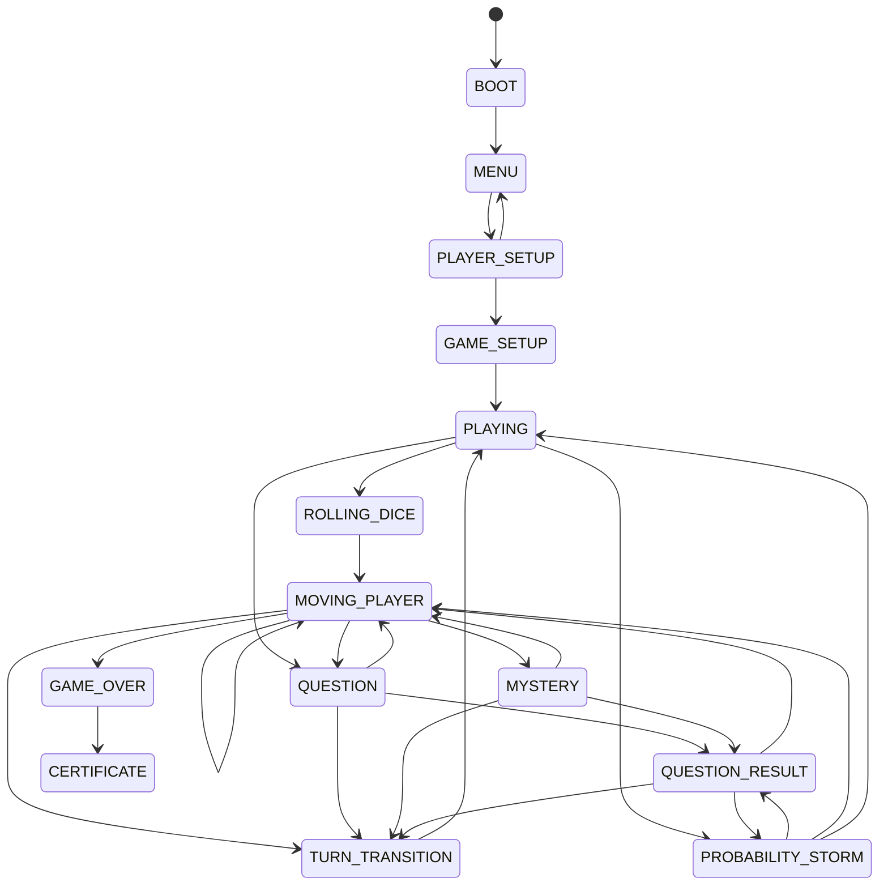

# Architecture

This project is a vanilla JavaScript browser game. The FSM owns game-flow transitions. Systems contain reusable game calculations, UI modules own DOM presentation, and `script.js` currently composes the systems, states, data, timers, and audio callbacks.

## Structure

```text
core/
  Game.js                 State registry and valid transition map
  GameContext.js          Shared game data, actions, and transition event
  GameState.js            State name constants
  StateMachine.js         Lifecycle and transition validation
states/
  MenuState.js            Menu screen entry
  PlayerSelectionState.js Player setup screen entry
  GameSetupState.js       Board/game initialization entry
  PlayingState.js         Active-play state
  RollingDiceState.js     Dice roll entry action
  MovingPlayerState.js    Regular, ladder, and snake movement actions
  QuestionState.js        Standard tile question entry
  MysteryState.js         Mystery tile question entry
  QuestionResultState.js  Answer-result presentation entry
  ProbabilityStormState.js Storm startup entry
  TurnTransitionState.js  Player turn advancement entry
  GameOverState.js        Winner handling entry
  CertificateState.js     Certificate presentation entry
systems/
  PlayerSystem.js         Player creation and reset
  TurnSystem.js           Turn rotation
  DiceSystem.js           Dice value selection
  MovementSystem.js       Destination, tile, snake, and ladder calculations
  QuestionSystem.js       Question selection and answer evaluation
  ScoreSystem.js          Player statistics
  WinConditionSystem.js   Finish-position check
ui/
  MenuUI.js, BoardUI.js, DiceUI.js, GameUI.js,
  QuestionUI.js, ModalUI.js, CertificateUI.js
tests/
  game-systems.test.mjs   Gameplay calculation regressions
  game-states.test.mjs    FSM lifecycle and payload tests
```

Question banks remain in `question/` and are loaded by the existing loader in `script.js`. Images and sounds remain in `images/` and `audio/`.

## FSM

`GameState` contains the state names. `Game` combines the state registry with the transition map. `StateMachine` validates each transition, tracks `currentState` and `previousState`, and invokes the previous state's `exit()` and next state's `enter()` hooks.

Concrete state handlers are injected into `Game`. Each handler delegates through `GameContext.actions`; it does not own game rules or directly import UI modules. The controller supplies those action implementations. Event-specific data is passed through `Game.transition(state, event)` and is available as `context.event` during the destination state's entry.

Repeated transitions to the current state are no-ops. Unknown states and transitions not present in the map throw descriptive errors.

## Transition Map



`Game.js` is authoritative if this diagram and code ever differ. `CERTIFICATE` is terminal in the current game flow; restarting reloads the page.

## State Responsibilities

- `MENU` and `PLAYER_SETUP` select their screen and set up the current profile workflow.
- `GAME_SETUP` resets player stats, creates the board, renders player information, starts the Storm countdown, and then transitions to `PLAYING`.
- `ROLLING_DICE` delegates to the existing dice animation action with a player number payload.
- `MOVING_PLAYER` delegates regular movement or ladder/snake animation based on an event payload.
- `QUESTION` and `MYSTERY` present the selected tile question and start its timer.
- `QUESTION_RESULT` displays the result payload.
- `PROBABILITY_STORM` starts the existing Storm audio, queue, and notification flow.
- `TURN_TRANSITION` advances the player and returns to `PLAYING`.
- `GAME_OVER` waits for the existing win sound delay, then transitions to `CERTIFICATE`.
- `CERTIFICATE` renders the leaderboard and winner certificate.

## Systems

Systems are DOM-independent gameplay logic. `PlayerSystem`, `TurnSystem`, `DiceSystem`, `MovementSystem`, `QuestionSystem`, `ScoreSystem`, and `WinConditionSystem` are instantiated by the entry controller. State handlers and controller actions call these systems; state classes should remain lifecycle coordinators rather than accumulate calculation logic.

## UI and Data Flow

UI classes own DOM selectors and presentation. They receive game data and callbacks; they do not decide movement, evaluate answers, award points, or select a winner.

The current question flow is:

```text
question JSON / fallback
  -> tile question: controller selects from the tile's matching pool
  -> Storm question: QuestionSystem selects a random question
  -> QUESTION or MYSTERY state
  -> QuestionUI presentation and input callback
  -> QuestionSystem evaluation
  -> ScoreSystem statistics
  -> QUESTION_RESULT state
  -> existing movement/turn action
```

The board and player positions are rendered by `BoardUI`. Turn and dice presentation use `MenuUI` and `DiceUI`. Storm timing and result modals use `GameUI` and `ModalUI`. Certificate rendering/export uses `CertificateUI`.

`index.html` loads `script.js` as an ES module. Legacy inline HTML callbacks are explicitly attached to `window` in `script.js`; preserve those names unless all HTML call sites are migrated together.

## Storage and Events

The current game does not read or write `localStorage` or `sessionStorage`. No storage service is needed until persistence is introduced; do not add a new storage key as part of an unrelated refactor.

There is no EventBus. Direct state entry actions and `GameContext.event` cover current synchronous transitions and payloads. Add an event bus only if a real decoupling need appears; avoid using it for simple direct calls.

## Adding a State

1. Add its constant in `core/GameState.js`.
2. Add allowed incoming/outgoing transitions in `core/Game.js`.
3. Create a small state class under `states/` with lifecycle hooks only where needed.
4. Register the state handler and its action in the `Game` composition in `script.js`.
5. Pass only the data needed by the state through the transition event.
6. Add lifecycle and transition tests in `tests/game-states.test.mjs`.

## Adding a System or Feature

Put deterministic rules/calculations in a system under `systems/`, and cover them with a focused test. Put DOM work in an existing UI module or a new UI module with one clear presentation responsibility. Inject the needed action into `GameContext`; do not let a state import the controller or another state. Preserve JSON names, DOM IDs/classes, inline handler names, and existing scoring/timing semantics unless a separate gameplay change is requested.

Current game modes are local multiplayer with 2–4 players. Duel, AI, class selection, and subject selection are not implemented in this repository and are intentionally not represented as new features here.
