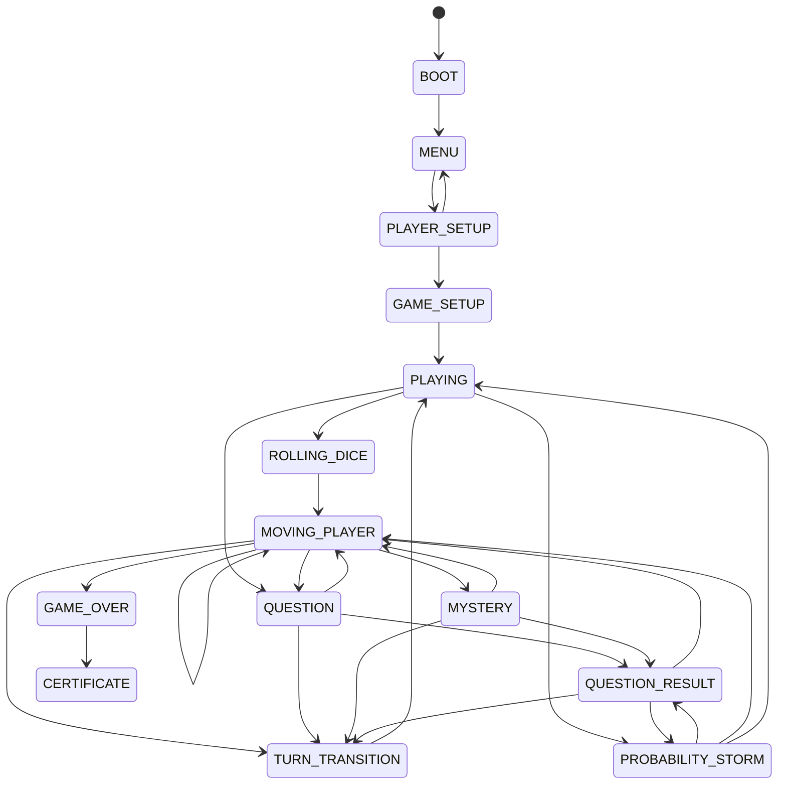

# GDD-TDD: Snakes & Ladders Mathematics Edition

## 1. Dokumentasi ini adalah sumber kebenaran repository

Dokumen ini dibuat berdasarkan analisis langsung terhadap isi repository yang ada saat ini, yaitu:

- README.md
- ARCHITECTURE.md
- core/
- states/
- systems/
- ui/
- tests/
- question/
- script.js
- index.html

Status yang digunakan dalam dokumen ini mengikuti pola berikut:

- IMPLEMENTED: fitur atau pola terbukti ada di kode dan/atau test.
- PARTIALLY IMPLEMENTED: ada fondasi atau alur kerja, tetapi belum sepenuhnya lengkap atau tidak terbukti di tests.
- PLANNED: disebut sebagai rencana atau target tapi belum diimplementasikan di repo saat ini.
- LEGACY: masih ada di repo tetapi tidak lagi merupakan jalur utama.
- DEPRECATED: kode/fitur tetap ada namun tidak digunakan lagi secara aktif.
- UNKNOWN: tidak cukup bukti dari repo untuk menilai statusnya.

## 2. Ringkasan produk

Proyek ini adalah game berbasis browser yang menggabungkan mekanisme klasik ular tangga dengan konten matematika probabilitas. Permainan dijalankan di frontend vanilla JavaScript, tanpa framework, dan didesain untuk pengalaman lokal multiplayer. Struktur permainan didukung oleh state machine yang mengatur lifecycle game dan transisi antar tampilan.

### Status umum

| Area                                      | Status                 | Bukti utama                                                 |
| ----------------------------------------- | ---------------------- | ----------------------------------------------------------- |
| Game loop & FSM                           | IMPLEMENTED            | core/Game.js, core/GameState.js, tests/game-states.test.mjs |
| Board movement & finish logic             | IMPLEMENTED            | systems/MovementSystem.js, tests/game-systems.test.mjs      |
| Question system                           | IMPLEMENTED            | systems/QuestionSystem.js, question/\*.json                 |
| Score/statistics                          | IMPLEMENTED            | systems/ScoreSystem.js, tests/game-systems.test.mjs         |
| Probability Storm                         | IMPLEMENTED            | states/ProbabilityStormState.js, script.js                  |
| Winner certificate export                 | IMPLEMENTED            | ui/CertificateUI.js, index.html                             |
| Audio / BGM / countdown                   | IMPLEMENTED            | script.js                                                   |
| Persistence (localStorage/sessionStorage) | NOT IMPLEMENTED        | tidak ada penggunaan storage di repo                        |
| AI / duel mode                            | PLANNED / NOT IN SCOPE | ARCHITECTURE.md menyebutkan tidak ada di repo               |
| Subject/class selection                   | PLANNED / NOT IN SCOPE | ARCHITECTURE.md menyebutkan tidak ada                       |

## 3. Tujuan desain game

Berdasarkan repo dan README, tujuan game adalah:

1. Mengubah mekanisme ular tangga menjadi aktivitas belajar probabilitas.
2. Menerapkan tantangan soal di setiap tile tertentu, bukan sekadar random movement.
3. Menggunakan turn-based local multiplayer antar 2 sampai 4 pemain.
4. Memberikan sensasi kompetisi melalui Probability Storm dan sistem statistik.
5. Menghasilkan pemenang dan sertifikat digital berbasis hasil akhir.

## 4. Gameplay dan aturan utama

### 4.1 Board dan finish condition

- Board dimodelkan sebagai papan 100 posisi.
- Finish condition diatur oleh `WinConditionSystem.hasWon(player, finishPosition = 100)`.
- Pergeseran pemain mengikuti mekanisme overshoot/bounce:
  - jika posisi target melewati 100, posisi kembali dari sisi lawan pada jarak kelebihan.
  - jika posisi hasil < 0, dibatasi menjadi 0.
- Aturan ini terimplementasi di `systems/MovementSystem.js` dan diverifikasi oleh test `movement preserves finish bounce and tile precedence`.

### 4.2 Special tile

Tile khusus dibuat secara dinamis berdasarkan tingkat kesulitan global permainan (`easy`, `standard`, `hard`).

- `easy`
- `standard`
- `hard`
- `mystery`

Masing-masing level memiliki pool pertanyaan sendiri dalam folder `question/` dan rute `questionPool` di `script.js`.

### 4.3 Question flow

Question diambil dari JSON lalu dipilih berdasarkan jenis soal dan tingkat kesulitan tertentu. Ada fallback ketika file JSON gagal di-load atau belum selesai dimuat.

Kelas yang bertanggung jawab:

- `QuestionSystem.js`: pemilihan pertanyaan dan evaluasi jawaban
- `script.js`: pengambil data game dan routing jawaban
- `QuestionUI.js`: tampilan soal dan interaksi pengguna

Question types yang ditemukan di repo:

- `multiple_choice`
- `true_false`
- `essay`
- `what_if`

Evaluasi jawaban dibagi menjadi:

- pilihan ganda / benar-salah: bandingkan langsung dengan `answer`
- essay / math / text: normalisasi string supaya bentuk seperti `1/2`, `5/36`, dan notasi matematika dapat dibandingkan lebih toleran

### 4.4 Nilai skor dan statistik

`PlayerSystem` menciptakan struktur pemain dengan atribut:

- `name`
- `image`
- `score`
- `stats`

`stats` mencakup:

- `correct`
- `wrong`
- `ladders`
- `snakes`
- `currentStreak`
- `maxStreak`
- `totalMoves`
- `stormWins`
- `mysterySolved`

Status pemain diperbarui di `ScoreSystem.js` untuk:

- `recordMove`
- `recordAnswer`
- `recordTimeout`
- `recordLadder`
- `recordSnake`
- `recordStormWin`

Timeout dianggap salah dan memutus streak saat ini. Ini terbukti di test `timed-out questions count as wrong and break the current streak`.

### 4.5 Probability Storm

Probability Storm adalah event game otomatis yang memerlukan turn-based queue antar pemain. Berdasarkan `states/ProbabilityStormState.js`, alurnya:

- jika event `resume` aktif, tampilkan pemain berikutnya tanpa memulai ulang event
- jika tidak, jalankan `beginProbabilityStorm()`

Fitur ini terdokumentasi di README dan terhubung ke `script.js` untuk:

- countdown / audio sirine
- transisi musik
- antrean pemain dalam Storm
- putaran menjawab pertanyaan khusus
- reward maju 3 langkah bila benar

Status: IMPLEMENTED dalam alur utama permainan, dengan validasi test FSM terkait resume storm.

### 4.6 Ladder dan snake logic

`script.js` mendefinisikan data set ladder dan snake sebagai array dua dimensi. Sebagian definisi tetap pada struktur array dari start-end posisi. Saat pemain berhenti pada cell ladder atau snake, gameplay memakai pending state dan memutuskan apakah pemain dibolehkan naik atau harus turun sesuai jawaban soal.

### 4.7 Achievement title

Gelar dihasilkan di `script.js` melalui fungsi `getAchievementTitle(player)`. Kriteria mencakup:

- akurasi sempurna
- streak tinggi
- banyak ladder / snake
- misteri selesai
- jumlah storm win
- default fallback `Juara Ular Tangga`

Status: IMPLEMENTED.

### 4.8 Sertifikat akhir

Sertifikat akhir ditampilkan pada state `CERTIFICATE` dan di-render oleh `CertificateUI.js`.

Komponen hasil certificate meliputi:

- nama pemenang
- gelar hasil dari `getAchievementTitle`
- statistik kemenangan:
  - jumlah benar
  - max streak
  - ladders
  - snakes
- tabel leaderboard untuk semua pemain

Ekspor PNG memakai `html2canvas` dan melakukan download dengan nama file `Sertifikat_MathGame_${playerName}.png`.

Status: IMPLEMENTED.

## 5. Arsitektur teknis

### 5.1 Struktur basis

```text
core/
  Game.js                 state registry dan validasi transisi
  GameContext.js          data runtime dan actions registry
  GameState.js            konstanta nama state
  StateMachine.js         lifecycle transisi FSM

states/
  MenuState.js
  PlayerSelectionState.js
  GameSetupState.js
  PlayingState.js
  RollingDiceState.js
  MovingPlayerState.js
  QuestionState.js
  MysteryState.js
  QuestionResultState.js
  ProbabilityStormState.js
  TurnTransitionState.js
  GameOverState.js
  CertificateState.js

systems/
  PlayerSystem.js
  TurnSystem.js
  DiceSystem.js
  MovementSystem.js
  QuestionSystem.js
  ScoreSystem.js
  WinConditionSystem.js

ui/
  MenuUI.js
  BoardUI.js
  DiceUI.js
  GameUI.js
  QuestionUI.js
  ModalUI.js
  CertificateUI.js

question/
  easyQuestion.json
  standarQuestion.json
  hardQuestion.json
  mysteryQuestion.json

tests/
  game-systems.test.mjs
  game-states.test.mjs
```

### 5.2 Prinsip arsitektur

Repositori mengikuti pola berikut:

- `core/`: FSM dan konteks runtime
- `states/`: lifecycle handler per state
- `systems/`: rules deterministik dan perhitungan permainan
- `ui/`: jendela DOM, rendering, dan interaksi tampilan
- `script.js`: orchestration utama dan wiring runtime

Ini sesuai dengan `ARCHITECTURE.md` dan konsisten dengan cara `GameContext.actions` dipanggil oleh state handlers.

### 5.3 Data flow utama

```text
user action / timer / state entry
  -> Game.transition(nextState, event)
  -> StateMachine validates transition
  -> state enter hook runs
  -> GameContext.actions.* executes
  -> UI + system updates
  -> next state or result state
```

## 6. State machine

Ini adalah state machine yang saat ini berlaku berdasarkan kode di `core/Game.js` dan `core/GameState.js`.



### 6.1 State responsibilities

- `MENU`: entry screen / selection awal
- `PLAYER_SETUP`: pengaturan pemain dan jumlah pemain
- `GAME_SETUP`: reset timer, reset stats, render board, memulai game session
- `PLAYING`: loop aktif permainan
- `ROLLING_DICE`: aksi lempar dadu
- `MOVING_PLAYER`: pergerakan normal atau event ladder/snake
- `QUESTION` / `MYSTERY`: menampilkan soal dan memulai timer
- `QUESTION_RESULT`: menampilkan hasil jawaban
- `PROBABILITY_STORM`: menyiapkan dan melanjutkan event badai probabilitas
- `TURN_TRANSITION`: lanjut ke giliran berikutnya
- `GAME_OVER`: menangani pemenang
- `CERTIFICATE`: menampilkan sertifikat dan leaderboard

## 7. Question library dan data source

Folder `question/` berisi file JSON yang menjadi bank soal. Di `script.js`, file di-load via `fetch()` dan disimpan ke `questionPool`.

### Data yang teridentifikasi

- `easyQuestion.json`
- `standarQuestion.json`
- `hardQuestion.json`
- `mysteryQuestion.json`

Setiap pool memiliki struktur yang biasanya mencakup jenis:

- `multiple_choice`
- `true_false`
- `essay`
- `what_if`

Jika file gagal di-load, `script.js` menggunakan `getFallbackQuestions(difficulty)` untuk memastikan permainan tetap berjalan.

Status: IMPLEMENTED.

## 8. Test design / TDD evidence

Repository memiliki test suite Node di folder `tests/`.

### Tes yang ada saat ini

1. `game-states.test.mjs`
   - lifecycle menu/player setup
   - setup game can transition to playing
   - payloads are delivered through state transitions
   - storm resume behavior

2. `game-systems.test.mjs`
   - player reset behavior
   - dice and turn rotation bounds
   - movement bounce logic
   - question evaluation
   - score, streak, storm win, and finish condition
   - timeout rules

### Status validasi saat ini

Command yang dijalankan:

```bash
node --test tests/*.test.mjs
```

Hasil yang didapat:

- 11 test pass
- 0 fail
- duration sekitar 72.9 ms

Ini menunjukkan project sedang dalam kondisi green untuk test yang saat ini tersedia.

## 9. Keterbatasan dan status yang tidak terimplementasi

### 9.1 Persistence

Repository tidak memiliki penggunaan `localStorage` atau `sessionStorage`.

Status: NOT IMPLEMENTED.

### 9.2 AI / duel

`ARCHITECTURE.md` secara eksplisit menyatakan:

- Duel tidak diimplementasikan
- AI tidak diimplementasikan
- class selection tidak diimplementasikan
- subject selection tidak diimplementasikan

Status: PLANNED / NOT IN SCOPE.

### 9.3 Build process

Repo ini bersifat static frontend. Tidak ada build pipeline atau bundler yang terdeteksi dalam struktur yang dibaca.

Status: IMPLEMENTED dalam bentuk static site, tidak ada build tooling yang dibutuhkan.

### 9.4 Persistence leaderboard / ranking server-side

Belum ada layanan backend, database, atau storage untuk skor permanen.

Status: UNKNOWN untuk kebutuhan produksi, namun tidak ada indikasi implementasi saat ini.

## 10. Risiko dan catatan implementasi

- Pembebanan pertanyaan bergantung pada `fetch` dari `question/*.json`; fallback disediakan, tetapi performa dan lintas browser tetap perlu diwaspadai.
- Audio memerlukan interaksi pengguna agar dapat berbunyi di browser modern; `script.js` menanggulangi ini melalui `.catch()` dan inisiasi setelah user interaction.
- `ProbabilityStormState` memiliki path `resume` yang dirancang agar event tidak direset ulang; ini penting untuk mencegah loop restart event.
- `CertificateUI` menargetkan elemen DOM dengan `html2canvas`, sehingga export sertifikat sangat bergantung pada adanya DOM certificate yang valid saat runtime.
- Tidak ada service layer yang memisahkan state dari DOM secara ketat; sebagian orchestration masih berada di `script.js`.

## 11. Panduan pengembangan lanjut

### 11.1 Menambah state baru

1. Tambahkan konstanta di `core/GameState.js`
2. Tambahkan valid transition di `core/Game.js`
3. Buat state class di `states/`
4. Register state handler di `script.js`
5. Uji transisi melalui `tests/game-states.test.mjs`

### 11.2 Menambah system baru

- Letakkan logika perhitungan di `systems/`
- Hindari menaruh logic game di UI layer
- Tambahkan test terfokus di `tests/game-systems.test.mjs`

### 11.3 Menambah fitur visual baru

- Letakkan rendering di `ui/`
- Pastikan aksi state tetap memanggil action melalui `GameContext.actions`
- Jangan menempatkan DOM logic di `core/` atau `states/` kecuali hanya untuk lifecycle minimal

## 12. Kesimpulan status proyek

Dari analisis repo yang ada, proyek ini secara umum berada dalam status:

- Game core: IMPLEMENTED
- Rule engine: IMPLEMENTED
- Question system: IMPLEMENTED
- Probability Storm: IMPLEMENTED
- Final certificate: IMPLEMENTED
- Local multiplayer flow: IMPLEMENTED
- Persistence and AI modes: NOT IMPLEMENTED / PLANNED

Secara keseluruhan, repo saat ini adalah game edukasi berbasis browser yang sudah berjalan secara fungsional dan memiliki test regresi yang lulus, dengan fokus utama pada mekanik matematika probabilitas dan turn-based local competition.

## 13. Referensi langsung repo

- README.md
- ARCHITECTURE.md
- core/Game.js
- core/GameContext.js
- core/GameState.js
- systems/MovementSystem.js
- systems/QuestionSystem.js
- systems/ScoreSystem.js
- states/ProbabilityStormState.js
- states/CertificateState.js
- ui/CertificateUI.js
- tests/game-states.test.mjs
- tests/game-systems.test.mjs
