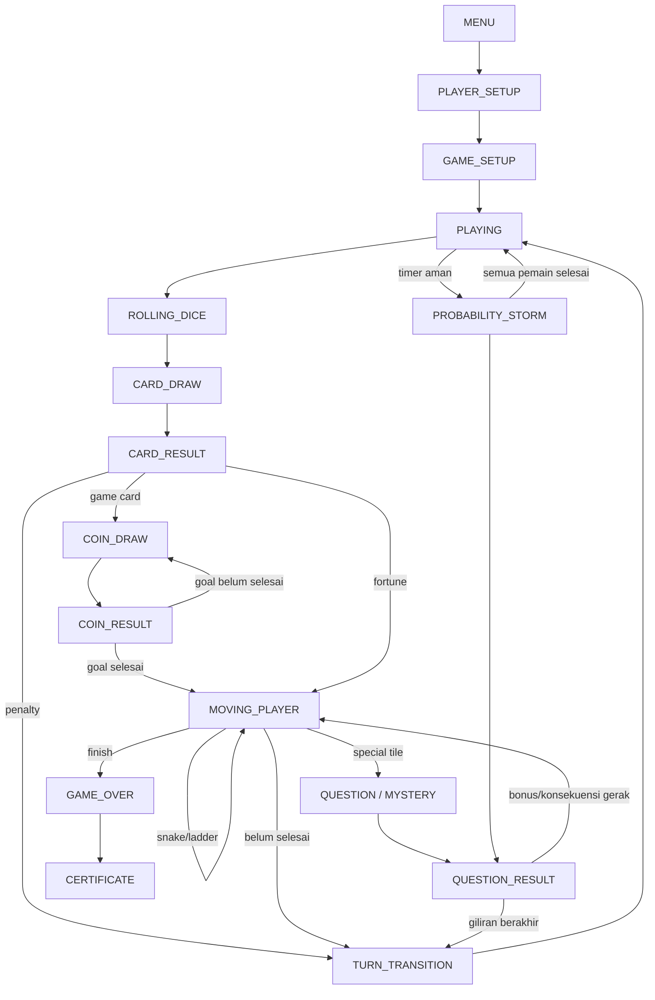
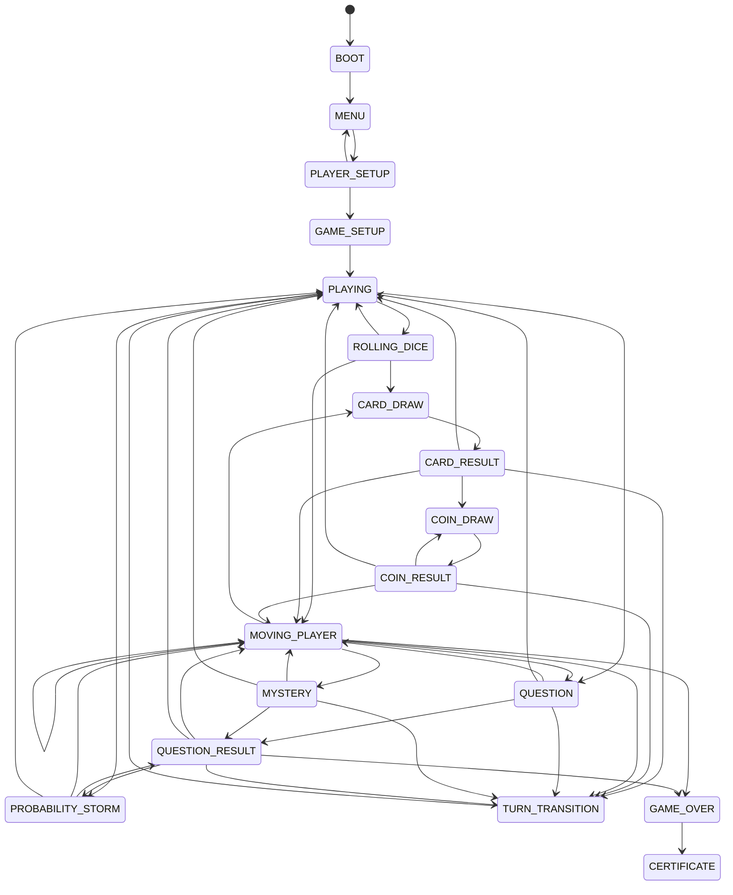
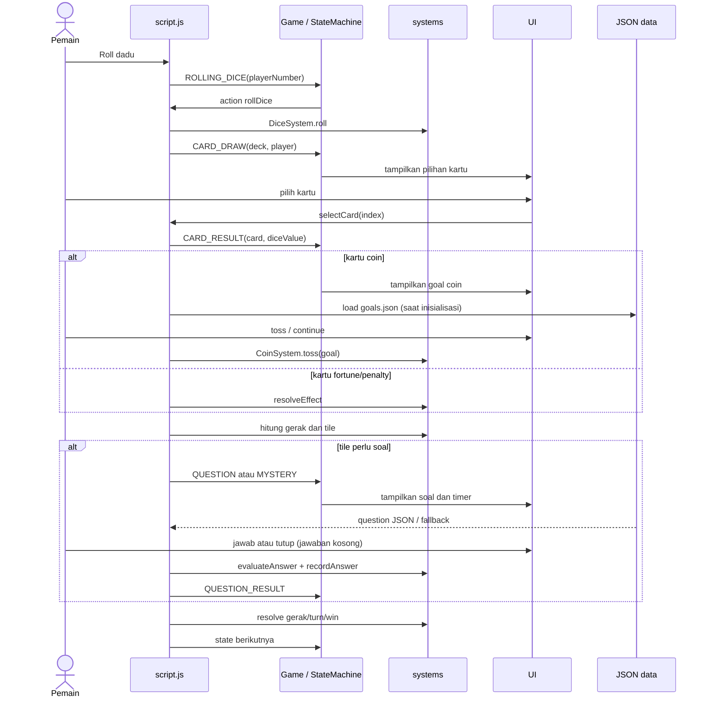
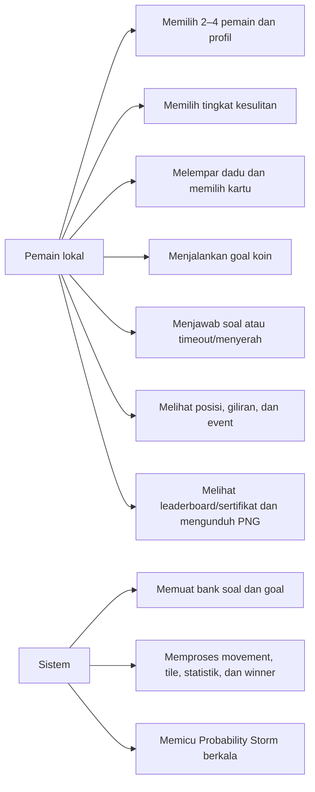
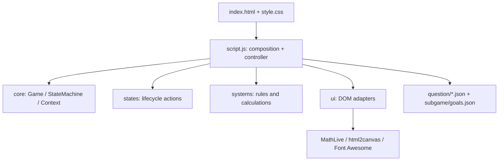
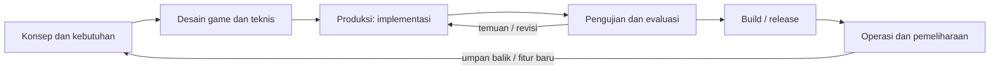

# Alur dan Kebutuhan Sistem

Dokumen ini merangkum interaksi dan alur yang ditemukan dari source. Diagram FSM merujuk langsung ke transisi di `core/Game.js`; arsitektur modul rinci ada di [ARCHITECTURE.md](ARCHITECTURE.md), desain dan aturan di [GDD-TDD.md](GDD-TDD.md), sedangkan bukti pengujian ada di [test.md](test.md).

## Status kebutuhan

| Kebutuhan | Status | Bukti / batas |
|---|---|---|
| Game browser statis, JavaScript ES modules | IMPLEMENTED | `index.html`, `script.js`; server lokal direkomendasikan untuk `fetch` JSON. |
| Local multiplayer 2–4 pemain, setup nama/avatar | IMPLEMENTED pada source | UI dan kontrol ada; belum ada bukti acceptance browser lengkap. |
| Dadu, giliran, gerak board 1–100, ular/tangga | IMPLEMENTED pada source | `systems/` dan controller; system test mencakup sebagian aturan. |
| Tile soal, mystery, Guardian, scoring | IMPLEMENTED pada source | UI + controller + `QuestionSystem`/`ScoreSystem`; interaksi browser belum terverifikasi penuh. |
| Card draw dan efek fortune/penalty/game | IMPLEMENTED pada source | FSM, `CardSystem`, `CardUI`, controller; hasil card lifecycle sebagian diuji melalui FSM/system. |
| Subgame coin A/G dengan goal JSON | IMPLEMENTED pada source | `CoinSystem`, UI/state; test unit/FSM tersedia, belum E2E. |
| Probability Storm, antrean dan audio | IMPLEMENTED pada source; validasi parsial | Controller dan state resume tersedia; interaksi timer/audio menyeluruh belum diuji. |
| Leaderboard lokal dan sertifikat PNG | IMPLEMENTED pada source; validasi parsial | `CertificateUI`/`html2canvas`; bukti download lintas browser tidak tersedia. |
| Flag tutorial tersimpan | IMPLEMENTED | `localStorage`; bukan penyimpanan progres atau leaderboard. |
| Persistensi sesi, backend, online multiplayer | PLANNED / NOT IMPLEMENTED | Tidak ditemukan implementasinya. |
| AI/NPC, duel, pilihan kelas/subjek | PLANNED / NOT IN SCOPE | Tidak ditemukan implementasinya. |
| Browser matrix, aksesibilitas, benchmark | UNKNOWN / NEEDS VERIFICATION | Bukti formal tidak ditemukan. |

## Game State Flowchart

Urutan startup aktual: pembuatan instance di `script.js` → `game.start()` → `MENU`; render board dan pemuatan data berjalan dari controller. Setup: `MENU → PLAYER_SETUP → GAME_SETUP → PLAYING`. Saat mulai game, stats pemain direset, board dan profil dirender, BGM/countdown dimulai. `localStorage` hanya menyimpan status tutorial yang pernah ditampilkan.

Alur giliran normal: `PLAYING → ROLLING_DICE → CARD_DRAW → CARD_RESULT → [COIN_DRAW → COIN_RESULT]*` atau gerak pion; gerak berikutnya dapat menuju pertanyaan/misteri, ular/tangga, giliran berikutnya, atau menang. `CARD_RESULT` penalty menuju `TURN_TRANSITION`; fortune memakai nilai dadu untuk movement. Coin goal selesai lalu gerakan memakai nilai dadu saat itu.

## FSM State Diagram (aktual)

Daftar berikut disalin dari `core/Game.js`. Transisi berulang ke state yang sama ditangani sebagai no-op oleh `StateMachine`, bukan edge FSM baru.

**Catatan implementasi:** timer soal/Storm dan animasi berjalan sebagai callback controller; FSM tidak otomatis membatalkannya. UI/modal tertentu juga punya kontrol yang harus tetap menyinkronkan state. Tombol tutup pertanyaan saat ini mengirim jawaban kosong melalui jalur submit (salah), bukan mengaktifkan dadu langsung. `Game.js` tetap otoritatif jika diagram berbeda.

## Gameplay Sequence Diagram

## Use Case Diagram

## Module Diagram

## Class Diagram

Diagram ini menunjukkan kelas yang benar-benar ditemukan dan hubungan komposisi/pemakaian tingkat modul. `script.js` adalah controller berbasis fungsi, bukan class. State handler menerima actions lewat `GameContext`; system/UI dibuat dan dihubungkan oleh controller.

```mermaid
classDiagram
  class Game {
    +start()
    +transition(nextState, event)
  }
  class StateMachine {
    +canTransition(nextState)
    +transition(nextState)
    +currentState
    +previousState
  }
  class GameContext {
    +data
    +actions
    +event
    +gameStatus
  }
  class GameController

  class MenuState
  class PlayerSelectionState
  class GameSetupState
  class PlayingState
  class RollingDiceState
  class MovingPlayerState
  class QuestionState
  class MysteryState
  class QuestionResultState
  class ProbabilityStormState
  class TurnTransitionState
  class CardDrawState
  class CardResultState
  class CoinDrawState
  class CoinResultState
  class GameOverState
  class CertificateState

  class PlayerSystem
  class TurnSystem
  class DiceSystem
  class MovementSystem
  class QuestionSystem
  class ScoreSystem
  class WinConditionSystem
  class CardSystem
  class CoinSystem

  class MenuUI
  class BoardUI
  class DiceUI
  class GameUI
  class QuestionUI
  class ModalUI
  class CardUI
  class CoinUI
  class CertificateUI

  Game *-- StateMachine : creates
  Game o-- GameContext : uses
  GameController ..> Game : composes
  GameController ..> GameContext : fills data/actions
  Game ..> MenuState : registers handlers
  Game ..> PlayerSelectionState
  Game ..> GameSetupState
  Game ..> PlayingState
  Game ..> RollingDiceState
  Game ..> MovingPlayerState
  Game ..> QuestionState
  Game ..> MysteryState
  Game ..> QuestionResultState
  Game ..> ProbabilityStormState
  Game ..> TurnTransitionState
  Game ..> CardDrawState
  Game ..> CardResultState
  Game ..> CoinDrawState
  Game ..> CoinResultState
  Game ..> GameOverState
  Game ..> CertificateState
  GameContext ..> GameState : gameStatus
  GameController ..> PlayerSystem : instantiates/uses
  GameController ..> TurnSystem
  GameController ..> DiceSystem
  GameController ..> MovementSystem
  GameController ..> QuestionSystem
  GameController ..> ScoreSystem
  GameController ..> WinConditionSystem
  GameController ..> CardSystem
  GameController ..> CoinSystem
  GameController ..> MenuUI : instantiates/uses
  GameController ..> BoardUI
  GameController ..> DiceUI
  GameController ..> GameUI
  GameController ..> QuestionUI
  GameController ..> ModalUI
  GameController ..> CardUI
  GameController ..> CoinUI
  GameController ..> CertificateUI
```

## GDLC (Game Development Life Cycle)

GDLC di bawah adalah pemetaan siklus pengembangan untuk mengelola project, bukan state machine runtime dan bukan bukti bahwa setiap tahap formal sudah dijalankan. Status tahap didasarkan pada artefak yang tersedia; tidak ditemukan catatan release/tag resmi.

| Tahap GDLC | Status bukti project | Artefak / pekerjaan |
|---|---|---|
| Konsep dan kebutuhan | PARTIALLY IMPLEMENTED | README, `GDD-TDD.md`, dan `flow-and-requirement.md` mendeskripsikan tujuan/fitur; persetujuan formal kebutuhan tidak ditemukan. |
| Desain | IMPLEMENTED sebagai dokumentasi desain | `ARCHITECTURE.md`, dokumen GDD-TDD, diagram FSM/alur. Sinkronisasi desain dengan code harus terus dijaga. |
| Produksi | IMPLEMENTED | Source frontend, data JSON, UI, audio/image assets, dan FSM tersedia. |
| Pengujian dan evaluasi | PARTIALLY IMPLEMENTED | Unit/FSM tests ada dan hasil historis dilaporkan; run terbaru serta E2E/browser matrix belum terverifikasi. Lihat `test.md`. |
| Release | UNKNOWN / NOT VERIFIED | Tidak ditemukan versi/tag, pipeline build, deployment, atau bukti acceptance formal. |
| Operasi dan pemeliharaan | UNKNOWN | Tidak ditemukan telemetry, issue log formal, atau proses maintenance/release berulang. |

## Rekomendasi pengembangan per tahap

1. Perjelas kebutuhan/aturan yang masih ambigu (misalnya semantik tutup soal dan efek fortune).
2. Jaga desain dan diagram tetap berasal dari source FSM/data flow aktual.
3. Implementasikan perubahan per system/state/UI boundary dan tambahkan regression test.
4. Jalankan test otomatis dan browser acceptance; simpan output serta bukti per skenario.
5. Tetapkan kriteria release dan versi hanya setelah validasi browser yang disepakati selesai.
6. Catat temuan pascarelease sebagai masukan iterasi berikutnya.

## Platform, batas, dan kebutuhan sistem

- **IMPLEMENTED:** static browser app, ES modules, HTML/CSS/JS; local HTTP server dianjurkan untuk `fetch`.
- **PARTIALLY IMPLEMENTED:** responsive CSS dan audio/MathLive/certificate integration ada, tetapi matriks perangkat/browser dan interaksi penuh tidak tersedia.
- **UNKNOWN:** browser minimum, performa minimum, aksesibilitas formal, release version/tag. Tidak ditemukan spesifikasi hardware formal atau changelog/tag dalam dokumen yang diaudit.
- **PLANNED / NOT IMPLEMENTED:** backend, penyimpanan hasil permanen, online play, AI/NPC, duel, kelas/subjek.

Kebutuhan runtime: browser modern yang mendukung JavaScript modules, DOM, `fetch`, media, dan library eksternal; koneksi atau aset lokal untuk CDN yang dipakai. Node.js digunakan untuk test, bukan runtime game.

## Release dan referensi

Tidak ditemukan informasi release version/tag yang dapat diverifikasi. Status hasil test dan batas cakupannya dicatat pada [test.md](test.md). Rencana produk/teknis ada di [GDD-TDD.md](GDD-TDD.md).
