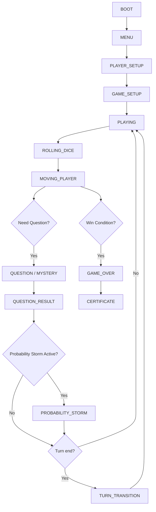
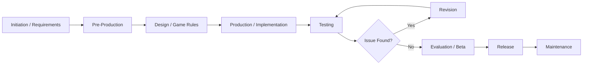
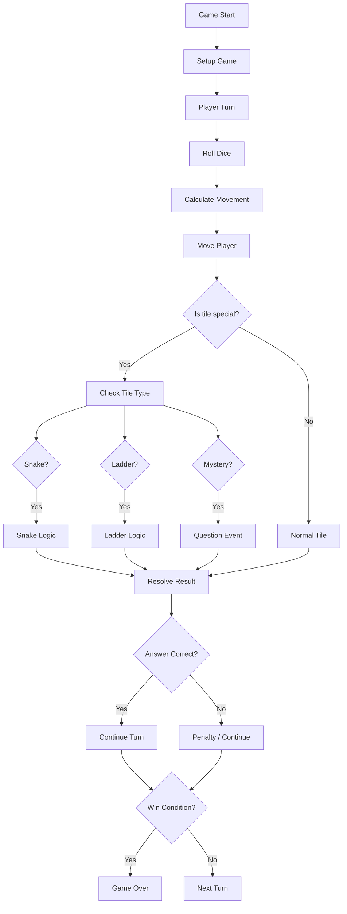
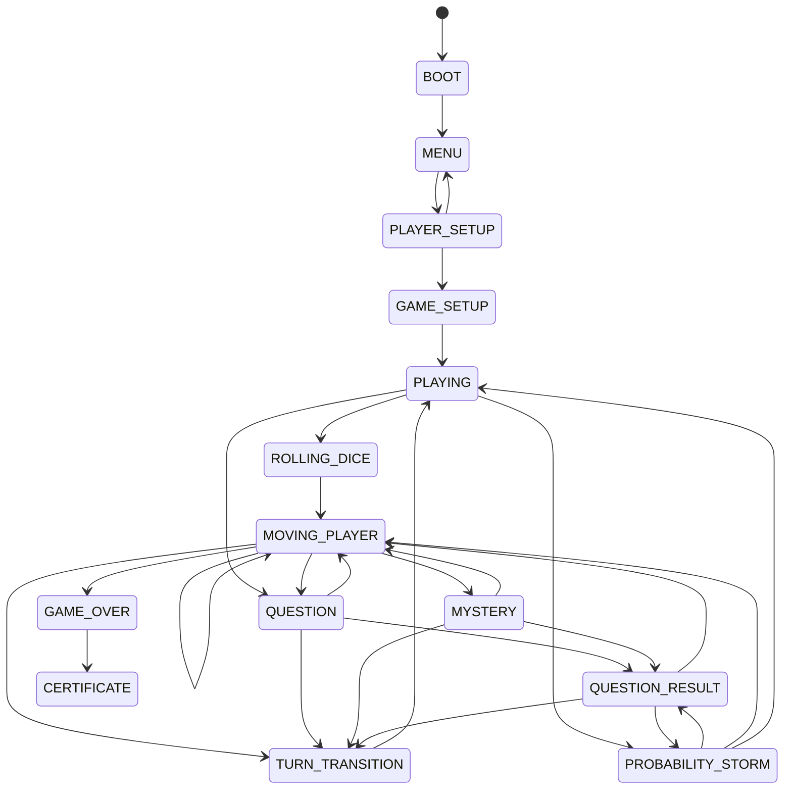
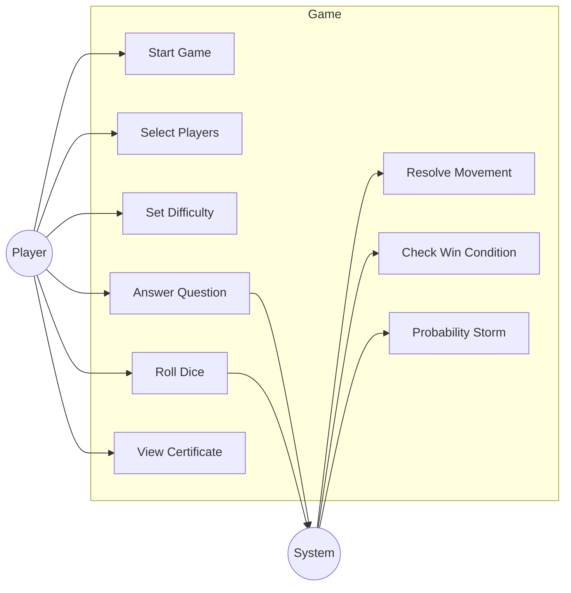
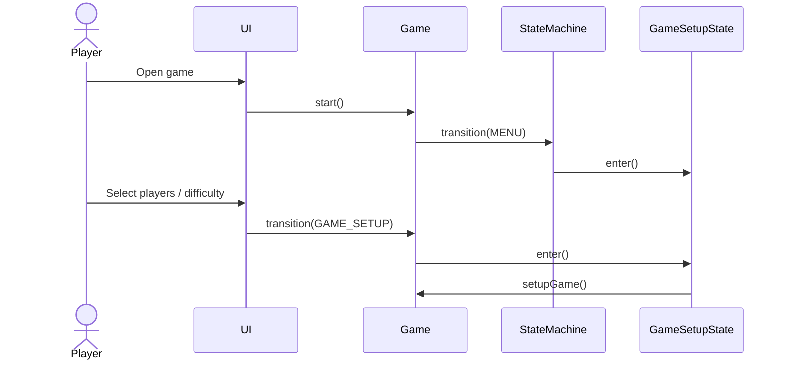
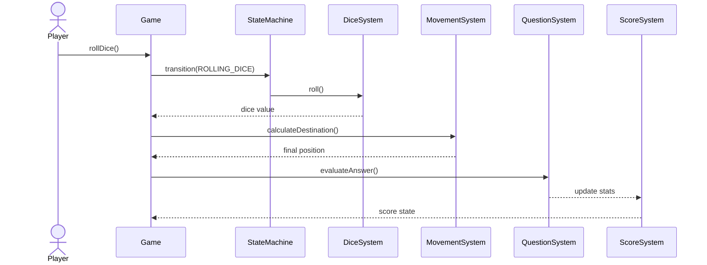
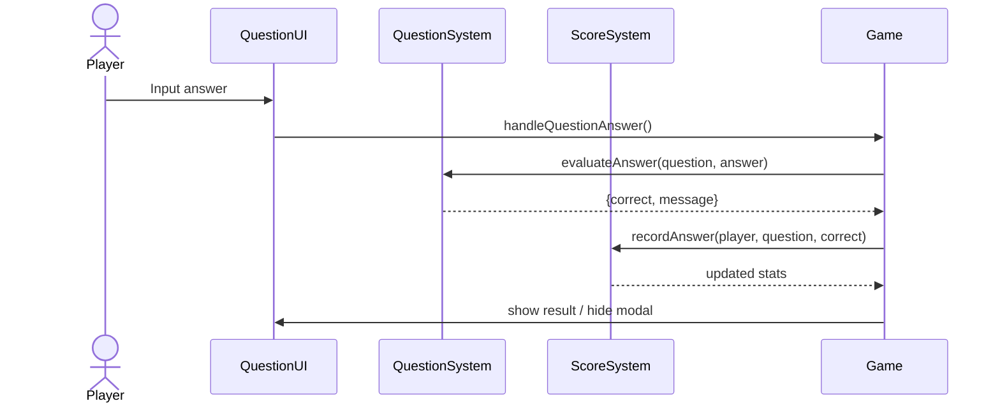
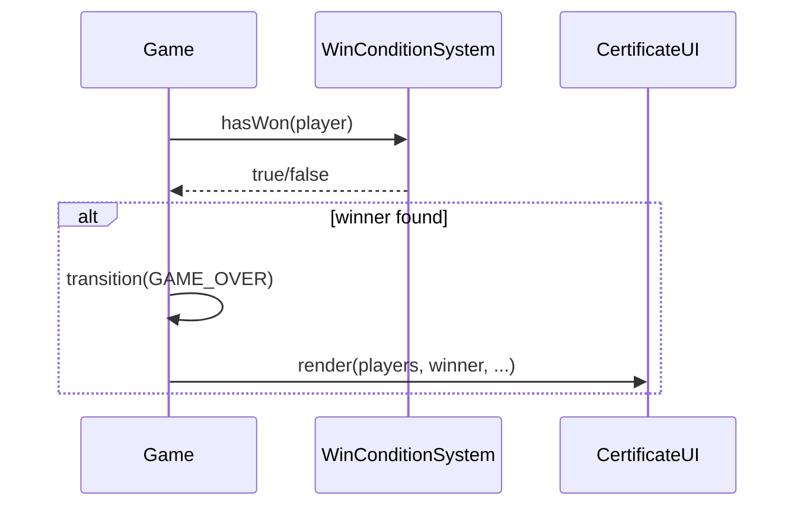
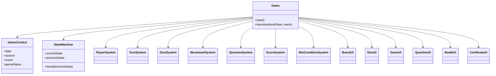

# FLOW AND REQUIREMENT

## 1. Document Information

| Item                 | Information                                                                                 |
| -------------------- | ------------------------------------------------------------------------------------------- |
| Project Name         | Snakes & Ladders Mathematics Edition                                                        |
| Document Name        | flow-and-requirement.md                                                                     |
| Document Type        | Flow & System Requirement                                                                   |
| Platform             | Web Browser (client-side static site)                                                       |
| Technology           | HTML5, CSS3, JavaScript (Vanilla ES Modules), JSON question banks, HTML5 audio, html2canvas |
| Engine/Framework     | Vanilla JavaScript; no framework or game engine detected                                    |
| Current Version      | Not formally versioned in repository                                                        |
| Documentation Status | Based on repository source code and tests                                                   |
| Last Updated         | 2026-10-01                                                                                  |

## 2. System Overview

### 2.1 Game Type

Game berbasis browser yang menggabungkan mekanisme ular tangga klasik dengan konten matematika probabilitas. Fokus utama permainan adalah turn-based local multiplayer dengan soal di tiap tile tertentu, event khusus, dan penghargaan akhir berupa sertifikat.

### 2.2 Core Gameplay

- 2–4 pemain lokal
- Giliran bergantian
- Lempar dadu
- Pindah posisi
- Deteksi tile
- Jawab soal jika tile memerlukan
- Evaluasi hasil jawaban
- Cek kondisi menang
- Lanjut ke giliran berikutnya

### 2.3 Player

- Player didefinisikan oleh `PlayerSystem`
- Setiap player memiliki `name`, `image`, `score`, dan `stats`
- Game default menyusun 4 profil pemain local: `Player1`–`Player4`

### 2.4 Main Interaction

- Start menu
- Player selection
- Difficulty selection
- Game setup
- Board rendering
- Dice roll
- Movement
- Question resolution
- Probability Storm event
- End-of-game certificate view

### 2.5 Educational Component

Game ini mengandung materi probabilitas dan pengujian pemahaman melalui soal yang dibagi berdasarkan tingkat kesulitan (`easy`, `standard`, `hard`, `mystery`). Soal disimpan di `question/*.json` dan dimuat saat runtime.

### 2.6 Platform Target

- Primary target: web browser
- Secondary: desktop browser experience with responsive layout for smaller screens
- Status: IMPLEMENTED for browser-based static play

## 3. Game State Flow

### 3.1 Game State Flow (Mermaid)



### 3.2 GDLC (Game Development Life Cycle) Flow

Catatan: repository tidak mencantumkan GDLC formal, jadi diagram berikut merupakan referensi umum berdasarkan workflow yang tampak dari repo.



Status: [REFERENCE / PROPOSED]

### 3.3 Gameplay Logic Flow



### 3.4 Decision Points

- Apakah pemain menang? (`WinConditionSystem.hasWon`)
- Apakah tile memerlukan pertanyaan? (`movementSystem.getTileDifficulty`)
- Apakah jawaban benar? (`QuestionSystem.evaluateAnswer`)
- Apakah event probability storm aktif? (`isStormActive`)
- Apakah giliran selesai? (dijalankan melalui state turn transition)

## 4. FSM Reference

### 4.1 Existing FSM

FSM yang aktif saat ini terletak di:

- `core/GameState.js`
- `core/Game.js`
- `core/StateMachine.js`
- `states/*.js`

### 4.2 State List

```text
BOOT
MENU
PLAYER_SETUP
GAME_SETUP
PLAYING
ROLLING_DICE
MOVING_PLAYER
QUESTION
MYSTERY
QUESTION_RESULT
PROBABILITY_STORM
TURN_TRANSITION
GAME_OVER
CERTIFICATE
```

### 4.3 State Transition Diagram



### 4.4 State Responsibility Table

| State             | Responsibility                          | Next State                                          |
| ----------------- | --------------------------------------- | --------------------------------------------------- |
| MENU              | entry screen                            | PLAYER_SETUP                                        |
| PLAYER_SETUP      | player count + identity selection       | GAME_SETUP                                          |
| GAME_SETUP        | reset board/state, start gameplay       | PLAYING                                             |
| PLAYING           | active turn loop                        | ROLLING_DICE / QUESTION / PROBABILITY_STORM         |
| ROLLING_DICE      | delegate dice action                    | MOVING_PLAYER                                       |
| MOVING_PLAYER     | move player, check ladder/snake/mystery | QUESTION / MYSTERY / TURN_TRANSITION / GAME_OVER    |
| QUESTION          | present normal question                 | QUESTION_RESULT                                     |
| MYSTERY           | present mystery question                | QUESTION_RESULT                                     |
| QUESTION_RESULT   | display evaluation                      | MOVING_PLAYER / TURN_TRANSITION / PROBABILITY_STORM |
| PROBABILITY_STORM | run event sequence                      | QUESTION_RESULT / MOVING_PLAYER / PLAYING           |
| TURN_TRANSITION   | advance turn                            | PLAYING                                             |
| GAME_OVER         | winner handling                         | CERTIFICATE                                         |
| CERTIFICATE       | leaderboard and certificate             | terminal                                            |

## 5. Use Case Diagram

### 5.1 Actors

| Actor     | Role                      | Status                        |
| --------- | ------------------------- | ----------------------------- |
| Player    | main game actor           | IMPLEMENTED                   |
| System    | game engine/controller    | IMPLEMENTED                   |
| Developer | maintenance and extension | IMPLEMENTED as authoring role |

### 5.2 Use Cases

| Actor  | Use Case                 | Description                       | Status      |
| ------ | ------------------------ | --------------------------------- | ----------- |
| Player | Start Game               | launch menu and begin flow        | IMPLEMENTED |
| Player | Select Number of Players | choose 2–4 players                | IMPLEMENTED |
| Player | Set Name / Profile       | set player identity               | IMPLEMENTED |
| Player | Set Difficulty           | choose global difficulty          | IMPLEMENTED |
| Player | Roll Dice                | generate movement value           | IMPLEMENTED |
| Player | Answer Question          | answer math question              | IMPLEMENTED |
| Player | Complete Turn            | finish turn and advance           | IMPLEMENTED |
| Player | View Certificate         | see end result data               | IMPLEMENTED |
| System | Evaluate Answer          | validate and score answer         | IMPLEMENTED |
| System | Check Win Condition      | decide if player reached tile 100 | IMPLEMENTED |
| System | Trigger Storm            | run probability storm event       | IMPLEMENTED |

### 5.3 Use Case Diagram



### 5.4 Relationship Notes

- Use case model is based on actual state transitions and action wiring in `script.js`.
- No AI actor or NPC opponent is implemented in current repo.
- `AI Player` remains [PLANNED] and not introduced into the actual use-case model.

## 6. Sequence Diagram

### 6.1 Game Initialization Sequence



### 6.2 Gameplay Turn Sequence



### 6.3 Question Handling Sequence



### 6.4 Game Completion Sequence



## 7. Class Diagram

### 7.1 Class / Module Inventory

| Class / Module        | Type   | Responsibility                             | Dependency                |
| --------------------- | ------ | ------------------------------------------ | ------------------------- |
| Game                  | class  | orchestrates transition and lifecycle      | StateMachine, GameContext |
| StateMachine          | class  | validates transitions and state changes    | GameState                 |
| GameContext           | class  | stores runtime data and action callbacks   | GameState                 |
| GameState             | object | holds named state constants                | -                         |
| MenuState             | class  | menu lifecycle                             | GameContext.actions       |
| PlayerSelectionState  | class  | player setup lifecycle                     | GameContext.actions       |
| GameSetupState        | class  | setup lifecycle                            | GameContext.actions       |
| PlayingState          | class  | gameplay active state                      | GameContext.actions       |
| RollingDiceState      | class  | dice trigger lifecycle                     | GameContext.actions       |
| MovingPlayerState     | class  | movement logic trigger                     | GameContext.actions       |
| QuestionState         | class  | question UI state                          | GameContext.actions       |
| MysteryState          | class  | mystery event state                        | GameContext.actions       |
| QuestionResultState   | class  | result screen lifecycle                    | GameContext.actions       |
| ProbabilityStormState | class  | storm lifecycle                            | GameContext.actions       |
| TurnTransitionState   | class  | turn advancement lifecycle                 | GameContext.actions       |
| GameOverState         | class  | winner handling lifecycle                  | GameContext.actions       |
| CertificateState      | class  | certificate entry lifecycle                | GameContext.actions       |
| PlayerSystem          | class  | player creation/reset                      | -                         |
| TurnSystem            | class  | turn rotation                              | -                         |
| DiceSystem            | class  | random dice value generation               | -                         |
| MovementSystem        | class  | movement and tile logic                    | -                         |
| QuestionSystem        | class  | random question and answer validation      | questionPool              |
| ScoreSystem           | class  | scoring and streak stats                   | player stats              |
| WinConditionSystem    | class  | evaluates finish condition                 | -                         |
| BoardUI               | class  | render board                               | DOM                       |
| DiceUI                | class  | render dice                                | DOM                       |
| GameUI                | class  | general game UI feedback                   | DOM                       |
| QuestionUI            | class  | question modal and answer input            | DOM                       |
| ModalUI               | class  | modal show/hide                            | DOM                       |
| CertificateUI         | class  | leaderboard + certificate rendering/export | DOM, html2canvas          |

### 7.2 Class Diagram Overview



### 7.3 Dependency Notes

- `script.js` composes major instances directly.
- UI classes are rendered through DOM and callback actions.
- There is no EventBus in current repository.
- State classes do not own core game calculations; logic remains in systems.

## 8. Platform and System Requirements

### 8.1 Target Platform

| Platform                 | Status                | Notes                                                                    |
| ------------------------ | --------------------- | ------------------------------------------------------------------------ |
| Web Browser              | IMPLEMENTED           | game is served as static HTML/JS                                         |
| Desktop Browser          | IMPLEMENTED           | primary play target                                                      |
| Tablet / Mobile viewport | PARTIALLY IMPLEMENTED | responsive CSS exists, browser UI not formally tested across all devices |
| Native app               | NOT APPLICABLE        | no packaging or runtime wrapper detected                                 |

### 8.2 Browser Compatibility

| Browser           | Status                                 | Notes                                                             |
| ----------------- | -------------------------------------- | ----------------------------------------------------------------- |
| Chromium / Chrome | Expected / Used in development context | likely supported; not explicitly documented as formal test matrix |
| Microsoft Edge    | Expected                               | no explicit evidence in repo                                      |
| Firefox           | Not Tested                             | no explicit evidence in repo                                      |
| Safari            | Not Tested                             | no explicit evidence in repo                                      |

### 8.3 Hardware Requirements

Repository does not include formal benchmark or minimum hardware data. Because it is a lightweight web game, requirements are likely low, but they are not formally benchmarked.

- Minimum: not formally specified
- Recommended: standard modern desktop or laptop with browser support
- Storage: minimal, mostly static assets and JSON question files

### 8.4 Software Requirements

| Requirement        | Status                                                                                  |
| ------------------ | --------------------------------------------------------------------------------------- |
| Operating System   | Any modern desktop OS with browser support                                              |
| Browser            | Modern browser with JavaScript enabled                                                  |
| JavaScript Runtime | Browser-supported ES modules                                                            |
| Audio Playback     | Browser audio support required for BGM and sound effects                                |
| Local file usage   | static site can run by opening HTML directly, but Live Server is recommended per README |

### 8.5 Development Requirements

| Item         | Status                                                    |
| ------------ | --------------------------------------------------------- |
| Code Editor  | VS Code is used in this environment                       |
| Git          | Not formally required by repo but suitable for versioning |
| Node.js      | Not required for runtime; used for tests here             |
| Local Server | Recommended per README, not mandatory                     |

## 9. Release Versions

### 9.1 Release History

Repository does not include a formal changelog or git tag history in the available files reviewed.

Status: Release history not formally recorded.

### 9.2 Version Strategy

Recommended versioning strategy, if project is formalized later:

```text
MAJOR.MINOR.PATCH
```

- MAJOR: breaking gameplay / architecture changes
- MINOR: new backward-compatible features
- PATCH: bug fixes and minor refinements

Status: [RECOMMENDED VERSIONING STRATEGY]

### 9.3 Release Milestones

| Milestone             | Status     |
| --------------------- | ---------- |
| Initial prototype     | [PROPOSED] |
| Feature-complete demo | [PROPOSED] |
| Stable release        | [PROPOSED] |

No formal release milestones were discovered in repo.

## 10. Diagram Summary

| Diagram             | Purpose                       | Status                              |
| ------------------- | ----------------------------- | ----------------------------------- |
| Game State Flow     | overview of state transitions | IMPLEMENTED                         |
| GDLC Flow           | lifecycle reference           | REFERENCE / PROPOSED                |
| Gameplay Logic Flow | end-to-end turn logic         | IMPLEMENTED                         |
| FSM Reference       | actual repo state machine     | IMPLEMENTED                         |
| Use Case Diagram    | actor interaction model       | IMPLEMENTED (based on actual flows) |
| Sequence Diagram    | runtime interaction trace     | IMPLEMENTED (based on source flow)  |
| Class Diagram       | architecture overview         | IMPLEMENTED (module-level)          |

## 11. Documentation Notes

### 11.1 Assumptions

- This document follows the repository source code as the primary authority.
- Game is a local browser game, not multiplayer online by default.
- There is no server-side backend or persistent leaderboard service in repo.

### 11.2 Proposed Elements

- Formal release versioning strategy
- Standardized QA checklist for browser/device matrix
- Optional online leaderboard or server-backed persistence

### 11.3 Missing Information

- Exact browser testing matrix
- Formal release history
- Hardware benchmark data
- Formal QA/UX test report
- Actual backend or cloud deployment configuration

### 11.4 Discrepancies

| Documentation Claim                                             | Actual Implementation                                                       | Resolution                     |
| --------------------------------------------------------------- | --------------------------------------------------------------------------- | ------------------------------ |
| README describes educational game and advanced settings         | source confirms browser game with local multiplayer and JSON question banks | use source as source of truth  |
| Some architecture notes mention AI / battle / subject selection | repo does not implement these as runtime features                           | mark as PLANNED / NOT IN SCOPE |
| Release history appears implied                                 | no formal release data in repo                                              | mark as not formally recorded  |

## 12. Testing Reference

Black Box Testing records are documented separately in [test.md](./test.md).

This file describes the flow, architecture, platform, and requirement view of the project. The testing file records evidence from automated verification and any historical testing data found in context.

## 13. Final Summary

Current state of project from code evidence:

- Game flow is operational and based on explicit state transitions.
- Core systems are implemented and tested.
- Question bank is loaded from JSON and fallback is present.
- Probability Storm is active and part of primary gameplay.
- Certificate export is implemented.
- There is no formal release history in repo.
- AI / online features / persistent backend are not implemented.

This document is intended as a blueprint for future development and for cross-checking new features against actual implementation.
